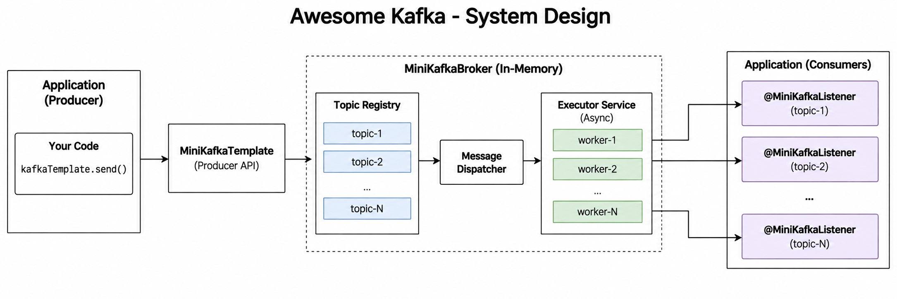

# Awesome Kafka (Mini Kafka Spring Boot Starter)

[](https://jitpack.io/#TornovDutta/awesome-kafka)

A lightweight, in-memory event broker that simulates Kafka's core concepts (publish/subscribe to topics) without requiring any external infrastructure. 

This project is built as a **Spring Boot Starter**. Other users can include it in their project and start using it immediately. **Zero configuration required!**



## How to Install (Public Access)

You can easily include this dependency in any Spring Boot application using [JitPack](https://jitpack.io/?utm_source=chatgpt.com#TornovDutta/awesome-kafka/v1.0.0).

### 1. Add the JitPack Repository
First, add the JitPack repository to your target project's `pom.xml`:

```xml
<repositories>
    <repository>
        <id>jitpack.io</id>
        <url>https://jitpack.io</url>
    </repository>
</repositories>
```

### 2. Add the Dependency
Next, add the `awesome-kafka` dependency:

```xml
<dependency>
    <groupId>com.github.TornovDutta</groupId>
    <artifactId>awesome-kafka</artifactId>
    <version>v1.0.0</version>
</dependency>
```

---

## Features
- **Persistent Disk Logs:** Messages are stored in append-only log files (`minikafka-data/`) for durability, surviving application restarts.
- **Offsets & Replayability:** Consumers track their byte offsets and read from the log, allowing them to replay historical messages.
- **Asynchronous Polling:** Dedicated background threads continuously poll for new messages decoupled from the producer.
- **Spring Boot Auto-configuration:** Automatically configures the broker, template, and listeners.

## Usage Guide

### 1. Produce Messages
Inject `MiniKafkaTemplate` into your services to send messages to a specific topic.

```java
import com.minikafka.core.MiniKafkaTemplate;
import org.springframework.beans.factory.annotation.Autowired;
import org.springframework.stereotype.Service;

@Service
public class OrderService {

    @Autowired
    private MiniKafkaTemplate kafkaTemplate;

    public void createOrder(String orderDetails) {
        // Business logic...
        System.out.println("Order created: " + orderDetails);
        
        // Publish an event to the "order-topic"
        kafkaTemplate.send("order-topic", orderDetails);
    }
}
```

### 2. Consume Messages
Use the `@MiniKafkaListener` annotation on any method within a Spring Bean to listen to a topic.

```java
import com.minikafka.annotation.MiniKafkaListener;
import org.springframework.stereotype.Component;

@Component
public class NotificationService {

    @MiniKafkaListener(topic = "order-topic")
    public void handleOrderEvent(String message) {
        System.out.println("Received order event: " + message);
        // Send notification...
    }
}
```

That's it! When `OrderService` sends a message, `NotificationService` will receive it asynchronously without any further setup required.
